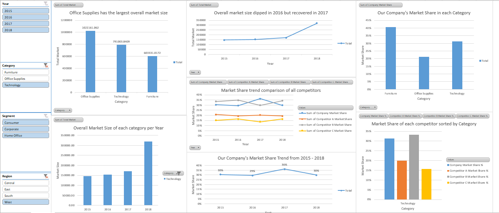

# 📊 Market Share Analysis Project

## Overview

This project analyzes market share performance in the consumer goods sector across three product categories: Furniture, Office Supplies, and Technology.

The goal is to evaluate competitive positioning, identify growth opportunities, and provide strategic recommendations using Excel.

---

## 🧠 Problem Statement

Companies often lack visibility into how they perform relative to competitors.

This project answers:

- Are we gaining or losing market share?
- Which competitors are outperforming us?
- Where should we invest to grow?

---

## 🛠 Tools Used

- Microsoft Excel
- Pivot Tables
- Calculated Fields
- Data Cleaning Techniques
- Dashboard Design (Charts & Slicers)

---

## 📂 Process

### 1. Data Preparation

- Removed duplicates
- Fixed date formats
- Validated key fields
- Simulated competitor data

---

### 2. Market Size Analysis

- Calculated total market by category
- Analyzed growth trends

---

### 3. Market Share Analysis

- Computed company and competitor shares
- Compared performance across categories

---

### 4. Dashboard Creation

- Built an interactive dashboard
- Visualized trends using charts and slicers

---

## 📈 Key Insights

- Office Supplies is the largest market but our company has low market share (21%).
- The company dominates Furniture (40%) but it is the smallest market.
- The company is a strong #2 in Technology (31%), close to the leader.
- Competitor B is the overall market leader (~30%).

---

## 🎯 Recommendations

- **Furniture:** Maintain position with minimal investment
- **Office Supplies:** Increase investment to gain share
- **Technology:** Compete aggressively to become market leader

---

## Preview

---

## LINKS

[Google Drive](https://drive.google.com/drive/folders/1Xrk7TpHp0203_tZnvDlMvyPOEluLwMls?usp=sharing)
